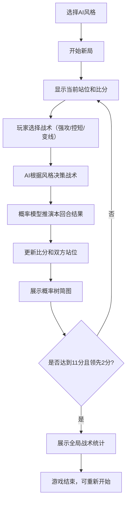

## 1. 产品概述

乒乓球战术推演棋盘是一款面向乒乓球教练员和运动员的战术训练辅助工具。通过2D俯视球台视角，模拟双方战术对抗过程，帮助用户直观理解不同战术选择的后续演变和胜率影响。

- 核心目标：降低战术决策的认知门槛，让运动员通过可视化推演理解"变线vs压中路"等专业选择的利弊
- 目标用户：乒乓球教练员、专业/业余运动员、战术分析爱好者
- 产品价值：将抽象的战术经验转化为可量化、可重复的推演模型

---

## 2. 核心功能

### 2.1 功能模块

1. **主游戏页面**：球台场景渲染、战术选择面板、比分显示、AI风格选择
2. **概率树展示模块**：每回合结束后展示本次对抗的胜率分支
3. **战术统计模块**：游戏结束后展示全局战术使用频率、成功率、关键分回顾

### 2.2 页面详情

| 页面名称 | 模块名称 | 功能描述 |
|----------|----------|----------|
| 主游戏页面 | 球台场景（PixiJS） | 俯视球台渲染、双方站位圆形标记动画、球的轨迹动画 |
| 主游戏页面 | 战术选择面板 | 三种战术按钮（强攻/控短/变线）、回合状态提示 |
| 主游戏页面 | 比分面板 | 当前比分、局分、发球方指示 |
| 主游戏页面 | AI风格选择器 | 开局前选择AI风格（防守反击/抢攻/变化型） |
| 概率树面板 | 概率树简图 | 展示玩家所选战术在三种AI应对下的胜率分支 |
| 统计面板 | 战术统计图表 | 各类战术使用频率、成功率柱状图 |
| 统计面板 | 关键分回顾 | 列出10平后或局点/赛点时的战术选择和结果 |

---

## 3. 核心流程

玩家选择AI风格后开始对局，每回合双方同时选择战术（玩家手动选择，AI根据风格权重决策），系统基于战术组合和当前站位用概率模型推演本回合胜负，更新比分和站位，展示概率树。达到11分且领先2分者获胜，结束后展示全局统计。

---

## 4. 用户界面设计

### 4.1 设计风格

- **主色调**：深青色（#0D4F4F）作为球台底色，橙红色（#FF6B35）作为玩家标记，浅蓝（#4ECDC4）作为AI标记，琥珀黄（#FFD93D）作为高亮强调色
- **辅助色**：深灰（#1A1A2E）背景，米白（#F5F0E1）文字
- **按钮风格**：圆角矩形，战术按钮有立体感和悬停动效，选中状态有发光边框
- **字体**：标题使用"ZCOOL KuaiLe"（中文手写风格，增加运动感），正文使用"Noto Sans SC"
- **布局**：左右分栏布局，左侧为PixiJS球台主场景（占65%宽度），右侧为控制面板和信息展示区（占35%宽度）
- **视觉风格**：运动科技风，带有微妙的网格线和发光效果，模拟专业战术分析屏幕

### 4.2 页面设计概览

| 页面名称 | 模块名称 | UI元素 |
|----------|----------|--------|
| 主游戏页面 | 球台场景 | 深青色球台、白色中线/边线、橙红/浅蓝圆形站位标记、球轨迹粒子效果 |
| 主游戏页面 | 战术选择面板 | 三个大按钮，每个带图标和文字说明（强攻⚡、控短🎯、变线↔️） |
| 主游戏页面 | 比分面板 | 大号数字显示，发球方有小球图标，当前领先者名字高亮 |
| 概率树面板 | 概率树简图 | 树状结构，节点显示战术名称和胜率百分比，连线粗细表示概率 |
| 统计面板 | 战术统计 | 彩色柱状图，X轴为战术类型，Y轴为频率/成功率 |

### 4.3 响应式

桌面端优先设计，球台场景按比例缩放。右侧控制面板在窄屏下可折叠为底部抽屉式布局。

---

## 5. 游戏规则详述

### 5.1 战术定义

| 战术 | 风险等级 | 效果说明 |
|------|----------|----------|
| 强攻（Attack） | 高风险高回报 | 站位优时胜率高，站位差时失误率高 |
| 控短（Control） | 低风险 | 主动提升自身站位优势，为下一板创造机会 |
| 变线（Redirect） | 中等风险 | 打乱对手站位节奏，克制中路连续压制 |

### 5.2 概率模型核心变量

- 双方当前站位坐标（距离球台中心的偏移量）
- 战术组合矩阵（3×3对抗矩阵）
- 站位优势系数（距离理想击球位置越近优势越大）
- 随机扰动因子（模拟实际比赛的不确定性）

### 5.3 AI风格权重

| AI风格 | 强攻权重 | 控短权重 | 变线权重 | 决策逻辑 |
|--------|----------|----------|----------|----------|
| 防守反击型 | 0.2（首板）/ 0.6（控短后） | 0.6 | 0.2 | 先控短争取主动，再伺机强攻 |
| 抢攻型 | 0.7 | 0.1 | 0.2 | 首板直接强攻，追求速战速决 |
| 变化型 | 0.33 | 0.33 | 0.34 | 三种战术随机混合，难以预测 |

### 5.4 计分规则

- 一局11分制
- 达到10平后，需领先2分才能获胜
- 每2分交换发球权
