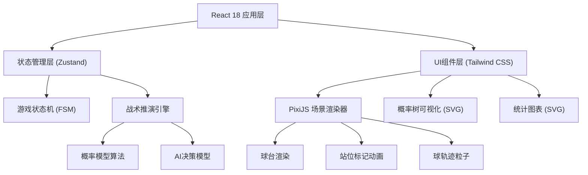

## 1. 架构设计



---

## 2. 技术选型说明

| 层级 | 技术 | 版本 | 用途 |
|------|------|------|------|
| 前端框架 | React | 18 | UI组件构建 |
| 语言 | TypeScript | 5.x | 类型安全 |
| 构建工具 | Vite | 5.x | 开发构建 |
| 样式 | Tailwind CSS | 3.x | 原子化CSS |
| 状态管理 | Zustand | 4.x | 全局游戏状态 |
| 2D渲染引擎 | PixiJS | 7.x | 球台场景渲染和动画 |
| 可视化 | 原生SVG | - | 概率树和统计图表 |
| 部署 | Docker + Nginx | - | 容器化部署 |

**技术选型理由**：
- PixiJS：高性能WebGL 2D渲染引擎，适合球台场景的实时动画和粒子效果
- Zustand：轻量级状态管理，适合游戏状态机的快速状态更新
- 原生SVG：概率树和统计图表结构相对固定，用原生SVG无需额外依赖

---

## 3. 核心模块设计

### 3.1 目录结构

```
src/
├── components/
│   ├── TableCanvas/        # PixiJS球台场景组件
│   ├── TacticsPanel/       # 战术选择面板
│   ├── ScoreBoard/         # 比分面板
│   ├── ProbabilityTree/    # 概率树可视化
│   ├── StatsPanel/         # 战术统计面板
│   └── AISelector/         # AI风格选择器
├── engine/
│   ├── types.ts            # 类型定义
│   ├── probability.ts      # 概率推演算法
│   ├── ai.ts               # AI决策模型
│   ├── stateMachine.ts     # 游戏状态机
│   └── constants.ts        # 常量配置
├── store/
│   └── useGameStore.ts     # Zustand状态管理
├── pages/
│   └── GamePage.tsx        # 主游戏页面
└── utils/
    └── helpers.ts          # 工具函数
```

### 3.2 核心数据模型

```typescript
// 战术类型
type TacticType = 'attack' | 'control' | 'redirect';

// AI风格
type AIStyle = 'counter' | 'aggressive' | 'variable';

// 站位坐标（球台归一化坐标，范围[-1, 1]）
interface Position {
  x: number;  // 左右偏移
  y: number;  // 前后偏移
}

// 玩家状态
interface PlayerState {
  position: Position;
  positionAdvantage: number;  // 站位优势系数 [-1, 1]
  lastTactic: TacticType | null;
}

// 单回合结果
interface RoundResult {
  playerTactic: TacticType;
  aiTactic: TacticType;
  playerWinRate: number;       // 玩家胜率
  aiWinRate: number;           // AI胜率
  winner: 'player' | 'ai';
  newPlayerPosition: Position;
  newAIPosition: Position;
  probabilityBranches: ProbabilityBranch[];  // 概率树分支数据
}

// 概率树分支
interface ProbabilityBranch {
  aiResponse: TacticType;
  playerWinProbability: number;
  description: string;
}

// 战术统计
interface TacticStats {
  attack: { used: number; won: number };
  control: { used: number; won: number };
  redirect: { used: number; won: number };
  criticalPoints: CriticalPoint[];
}

// 关键分记录
interface CriticalPoint {
  round: number;
  playerScore: number;
  aiScore: number;
  playerTactic: TacticType;
  aiTactic: TacticType;
  winner: 'player' | 'ai';
  isGamePoint: boolean;
}
```

### 3.3 概率推演算法设计

**输入**：玩家战术、AI战术、双方当前站位优势
**输出**：胜率分布、新的站位坐标

```
算法流程：
1. 查询3×3战术对抗矩阵，获得基础胜率
2. 根据双方站位优势系数调整胜率
   - 站位优势每增加0.1，胜率提升约3%
   - 强攻战术对站位优势敏感度最高（×2.0系数）
   - 控短战术对站位优势敏感度最低（×0.5系数）
3. 应用随机扰动（±8%范围的正态分布噪声）
4. 根据胜者计算新站位：
   - 胜者向球台中心移动（站位优势+0.15）
   - 败者根据对手战术偏移：
     * 被强攻 → 向两侧偏移
     * 被控短 → 向前（近网）偏移
     * 被变线 → 向相反方向偏移
```

### 3.4 AI决策模型

```typescript
// AI权重配置
const AI_WEIGHTS: Record<AIStyle, Record<TacticType, number>> = {
  counter: {      // 防守反击型
    attack: 0.2,
    control: 0.6,
    redirect: 0.2
  },
  aggressive: {   // 抢攻型
    attack: 0.7,
    control: 0.1,
    redirect: 0.2
  },
  variable: {     // 变化型
    attack: 0.33,
    control: 0.33,
    redirect: 0.34
  }
};

// 防守反击型特殊逻辑：上一板控短后，强攻权重提升至0.6
```

### 3.5 游戏状态机

```
状态枚举：
- 'selecting_style'   选择AI风格
- 'waiting_input'     等待玩家选择战术
- 'resolving'         推演结算中（播放动画）
- 'showing_tree'      展示概率树
- 'game_over'         游戏结束
```

状态转移：
```
selecting_style → waiting_input (开始游戏)
waiting_input → resolving (玩家选择战术)
resolving → showing_tree (推演完成)
showing_tree → waiting_input (继续) 或 game_over (胜负已分)
game_over → selecting_style (重新开始)
```

---

## 4. 路由定义

| 路由 | 页面 | 说明 |
|------|------|------|
| `/` | GamePage | 主游戏页面（唯一页面） |

---

## 5. Docker部署配置

使用多阶段构建：Node.js构建产物 → Nginx提供静态服务

```yaml
# docker-compose.yml 结构
services:
  web:
    build: .
    ports:
      - "8080:80"
    restart: unless-stopped
```

Dockerfile采用：
1. Stage 1 (node:18-alpine): 安装依赖 → `npm run build`
2. Stage 2 (nginx:alpine): 复制dist目录 → 暴露80端口

---

## 6. PixiJS渲染方案

### 6.1 场景结构
```
Stage (根容器)
└── TableContainer (球台容器)
    ├── TableBackground (深青色球台底 + 网格纹理)
    ├── TableLines (白色边线、中线、球网)
    ├── BallTrailLayer (球轨迹粒子容器)
    ├── AIMarker (AI站位标记 - 浅蓝色圆形)
    └── PlayerMarker (玩家站位标记 - 橙红色圆形)
```

### 6.2 动画方案
- 站位移动：使用PIXI.Ticker实现线性插值平滑移动（每回合0.5秒过渡）
- 球轨迹：在双方站位之间绘制粒子弧线，使用透明度渐变模拟球速感
- 获胜高亮：胜者标记短暂放大+发光滤镜效果
